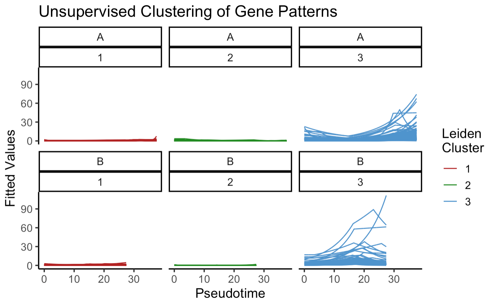

<!-- badges: start -->
[](https://codecov.io/gh/jr-leary7/scLANE)
[](https://github.com/jr-leary7/scLANE/actions/workflows/R-CMD-check.yaml)
<!-- badges: end -->

# scLANE

The `scLANE` package enables users to accurately determine differential expression of genes over pseudotime or latent time, and to characterize gene's dynamics using interpretable model coefficients. `scLANE` builds upon the [`marge` modeling framework](https://github.com/JakubStats/marge) developed by Stoklosa & Warton, and applies `marge`'s negative binomial GLM spline models to scRNA-seq data. 

# Installation 

You can install `scLANE` (once the repository becomes public) as follows:

```
remotes::install_github("jr-leary7/scLANE")
```

# Identifying Differentially Expressed Genes

Say we have a matrix of integer counts (non-normalized) named `expr_mat` and a dataframe of pseudotime values named `pt_df`. We can then use those as inputs to the main test function in `scLANE`, `testDynamic()`, in order to determine which genes are differentially expressed over pseudotime at the per-lineage level i.e., if there are more than one pseudotime lineages, we'll generate DE test statistics per-gene, per-lineage. In addition, if the number of cells and/or genes is high, we'll want to use the built-in parallel processing to speed up the function's execution. The below function call illustrates the default GLM_based funcionality. 

```
gene_stats <- testDynamic(expr.mat = expr_mat, 
                          pt = pt_df, 
                          parallel = TRUE, 
                          n.cores = 5)
```

We can also use GEE models if we have observations from multiple subjects. The main difference with the GEE functionality is that we need to provide a vector of subject IDs. In addition, the observations in the expression matrix pseudotime dataframe **must** be sorted by subject ID - this is a requirement to fit the GEE model correctly, and if the observations aren't sorted correctly an error will be thrown. In addition, we need to provide one of the correlation structures supported by `geeM::geem()` (the underlying GEE model fitting package). The options for possible working correlation structures are "ar1", "exchangeable", "independence", or "unstructured". Once we supply those arguments though, the function works just the same as it does for the GLM `marge` models, and the output is in the exact same format. 

```
gene_stats <- testDynamic(expr.mat = expr_mat, 
                          pt = pt_df, 
                          is.gee = TRUE, 
                          id.vec = subject_IDs, 
                          cor.structure = "exchangeable", 
                          parallel = TRUE, 
                          n.cores = 5)
```

After running `testDynamic()`, which returns a list containing model statistics, test results, & fitted values, we'll use `getResultsDE()` to format that list into a tidy table of results at the per-gene, per-lineage level. 

```
dyn_test_results <- getResultsDE(gene_stats)
```

In addition, we can use `testSlope()` to identify the pseudotime intervals over which is gene is differentially or non-differentially expressed. 

```
slope_test_results <- testSlope(test.dyn.results = gene_stats, 
                                p.adj.method = "bonferroni", 
                                fdr.cutoff = 0.01)
```

Next, fitted values from the `marge`, intercept-only, GLM, and GAM models can be plotted over gene expression & pseudotime using `plotModels()`. In this case we'd be plotting the results for the gene AURKA. 

```
plotModels(test.dyn.res = gene_stats, 
           gene = "AURKA", 
           pt = pt_df, 
           gene.counts = sim_counts)
```

We can also plot the results for GEE-based `marge` models and compare them to an intercept-only NB GEE and an NB GEE with pseudotime as a covariate. Note that the GEE-specific arguments are the same as are used in `testDynamic()`, so hopefully it isn't too confusing to use. 

```
plotModels(test.dyn.res = gene_stats, 
           gene = "AURKA", 
           pt = pt_df, 
           gene.counts = sim_counts
           is.gee = TRUE, 
           id.vec = subject_IDs, 
           cor.structure = "exchangeable")
```

In addition, we can cluster the fitted values from each model, in effect clustering the patterns exhibited across different types of genes, as follows. Three different clustering algorithms are currently supported: hierarchical clustering, *k*-means, and graph-based clustering with the Leiden algorithm. All three methods have built-in parameter tuning using clustering quality metrics such as the silhouette score. 

```
gene_clusters <- clusterGenes(test.dyn.results = gene_stats, clust.algo = "leiden")
```

Now we can prepare the data for visualization using `plotClusteredGenes()`, which we then feed into `ggplot2` to obtain the below plot: 

```
plot_data <- plotClusteredGenes(test.dyn.results = gene_stats, 
                                gene.clusters = gene_clusters, 
                                pt = pt_df)
ggplot(plot_data, aes(x = PT, y = FITTED, color = CLUSTER, group = GENE)) + 
  facet_wrap(~paste0("Lineage ", LINEAGE) + CLUSTER) + 
  geom_line() + 
  scale_color_manual(values = c("firebrick", "forestgreen", "steelblue3")) + 
  labs(x = "Pseudotime", 
       y = "Fitted Values", 
       color = "Leiden\nCluster", 
       title = "Unsupervised Clustering of Gene Patterns") + 
  theme_classic(base_size = 14) + 
  theme(plot.title = element_text(hjust = 0.5)) + 
  guides(color = guide_legend(override.aes = list(size = 2)))
```



# Contact Information 

This package is developed & maintained by Jack Leary. Feel free to reach out by opening an issue or by email (j.leary@ufl.edu) if more detailed assistance is needed. 
