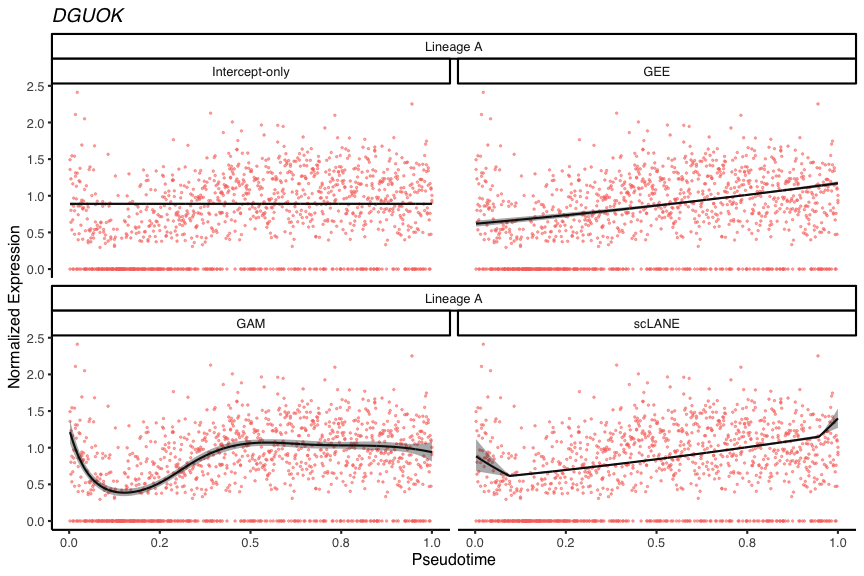

- [`scLANE`](#sclane)
  - [Installation](#installation)
  - [Model structure](#model-structure)
- [Usage](#usage)
  - [Libraries](#libraries)
  - [Input data](#input-data)
  - [Trajectory DE testing](#trajectory-de-testing)
  - [Downstream analysis &
    visualization](#downstream-analysis--visualization)
- [Conclusions & best practices](#conclusions--best-practices)
- [Contact information](#contact-information)
- [References](#references)

<!-- README.md is generated from README.Rmd. Please edit that file -->

# `scLANE`

<!-- badges: start -->

[](https://github.com/jr-leary7/scLANE/actions/workflows/R-CMD-check.yaml)


[](https://codecov.io/gh/jr-leary7/scLANE)
[](https://www.codefactor.io/repository/github/jr-leary7/sclane)
[](https://doi.org/10.5281/zenodo.10030621)
[](https://opensource.org/licenses/MIT)
<!-- badges: end -->

## Installation

You can install the most recent version of `scLANE` using:

``` r
remotes::install_github("jr-leary7/scLANE")
```

## Model structure

The `scLANE` package enables users to accurately determine differential
expression of genes over pseudotime or latent time, and to characterize
gene’s dynamics using interpretable model coefficients. `scLANE` builds
upon the [`marge` modeling
framework](https://github.com/JakubStats/marge), allowing users to
characterize their trajectory’s effects on mRNA expression using
negative binomial
[GLMs](https://en.wikipedia.org/wiki/Generalized_linear_model),
[GEEs](https://en.wikipedia.org/wiki/Generalized_estimating_equation),
or
[GLMMs](https://en.wikipedia.org/wiki/Generalized_linear_mixed_model),
depending on the experimental design & biological questions of interest.
This modeling framework is an extension of the well-known [Multivariate
Adapative Regression Splines
(MARS)](https://en.wikipedia.org/wiki/Multivariate_adaptive_regression_spline)
method, which uses truncated power basis splines to build nonlinear
models using a [generalized cross validation (GCV)
criterion](https://doi.org/10.48550/arXiv.1706.02495).

A quickstart guide on how to use `scLANE` with simulated data continues
below, and a more detailed vignette showcasing its performance on real
data can be found
[here](https://jr-leary7.github.io/quarto-site/tutorials/scLANE_Trajectory_DE.html).

# Usage

Our method relies on a relatively simple test in order to define whether
a given gene is differentially expressed (or “dynamic”) over the
provided trajectory. While the exact structure of the test differs by
model backend, the concept is the same: the spline-based NB GLM / GEE /
GLMM is treated as the alternate model, and a null model is fit using
the corresponding model backend. If the GLM backend is used, then the
null model is simply an intercept-only NB GLM; the GEE backend fits an
intercept-only model with the same working correlation structure as the
alternate model, and if the GLMM backend is used then the null model is
an intercept-only model with random intercepts for each subject. The
alternate hypothesis is thus that at least one of the estimated
coefficients is significantly different from zero. We predict a given
gene to be dynamic if the adjusted *p*-value of the test is less than an
*a priori* threshold; the default threshold is 0.01, and the default
adjustment method is [the Holm
correction](https://en.wikipedia.org/wiki/Holm–Bonferroni_method).

## Libraries

First we’ll also need to load a couple dependencies & resolve a function
conflict.

``` r
library(dplyr)
#> 
#> Attaching package: 'dplyr'
#> The following objects are masked from 'package:stats':
#> 
#>     filter, lag
#> The following objects are masked from 'package:base':
#> 
#>     intersect, setdiff, setequal, union
library(scater)
#> Loading required package: SingleCellExperiment
#> Loading required package: SummarizedExperiment
#> Loading required package: MatrixGenerics
#> Loading required package: matrixStats
#> 
#> Attaching package: 'matrixStats'
#> The following object is masked from 'package:dplyr':
#> 
#>     count
#> 
#> Attaching package: 'MatrixGenerics'
#> The following objects are masked from 'package:matrixStats':
#> 
#>     colAlls, colAnyNAs, colAnys, colAvgsPerRowSet, colCollapse,
#>     colCounts, colCummaxs, colCummins, colCumprods, colCumsums,
#>     colDiffs, colIQRDiffs, colIQRs, colLogSumExps, colMadDiffs,
#>     colMads, colMaxs, colMeans2, colMedians, colMins, colOrderStats,
#>     colProds, colQuantiles, colRanges, colRanks, colSdDiffs, colSds,
#>     colSums2, colTabulates, colVarDiffs, colVars, colWeightedMads,
#>     colWeightedMeans, colWeightedMedians, colWeightedSds,
#>     colWeightedVars, rowAlls, rowAnyNAs, rowAnys, rowAvgsPerColSet,
#>     rowCollapse, rowCounts, rowCummaxs, rowCummins, rowCumprods,
#>     rowCumsums, rowDiffs, rowIQRDiffs, rowIQRs, rowLogSumExps,
#>     rowMadDiffs, rowMads, rowMaxs, rowMeans2, rowMedians, rowMins,
#>     rowOrderStats, rowProds, rowQuantiles, rowRanges, rowRanks,
#>     rowSdDiffs, rowSds, rowSums2, rowTabulates, rowVarDiffs, rowVars,
#>     rowWeightedMads, rowWeightedMeans, rowWeightedMedians,
#>     rowWeightedSds, rowWeightedVars
#> Loading required package: GenomicRanges
#> Loading required package: stats4
#> Loading required package: BiocGenerics
#> 
#> Attaching package: 'BiocGenerics'
#> The following objects are masked from 'package:dplyr':
#> 
#>     combine, intersect, setdiff, union
#> The following objects are masked from 'package:stats':
#> 
#>     IQR, mad, sd, var, xtabs
#> The following objects are masked from 'package:base':
#> 
#>     anyDuplicated, append, as.data.frame, basename, cbind, colnames,
#>     dirname, do.call, duplicated, eval, evalq, Filter, Find, get, grep,
#>     grepl, intersect, is.unsorted, lapply, Map, mapply, match, mget,
#>     order, paste, pmax, pmax.int, pmin, pmin.int, Position, rank,
#>     rbind, Reduce, rownames, sapply, setdiff, sort, table, tapply,
#>     union, unique, unsplit, which.max, which.min
#> Loading required package: S4Vectors
#> 
#> Attaching package: 'S4Vectors'
#> The following objects are masked from 'package:dplyr':
#> 
#>     first, rename
#> The following objects are masked from 'package:base':
#> 
#>     expand.grid, I, unname
#> Loading required package: IRanges
#> 
#> Attaching package: 'IRanges'
#> The following objects are masked from 'package:dplyr':
#> 
#>     collapse, desc, slice
#> Loading required package: GenomeInfoDb
#> Loading required package: Biobase
#> Welcome to Bioconductor
#> 
#>     Vignettes contain introductory material; view with
#>     'browseVignettes()'. To cite Bioconductor, see
#>     'citation("Biobase")', and for packages 'citation("pkgname")'.
#> 
#> Attaching package: 'Biobase'
#> The following object is masked from 'package:MatrixGenerics':
#> 
#>     rowMedians
#> The following objects are masked from 'package:matrixStats':
#> 
#>     anyMissing, rowMedians
#> Loading required package: scuttle
#> Loading required package: ggplot2
library(scLANE)
#> Loading required package: glm2
#> Loading required package: magrittr
#> 
#> Attaching package: 'magrittr'
#> The following object is masked from 'package:GenomicRanges':
#> 
#>     subtract
library(ggplot2)
select <- dplyr::select
filter <- dplyr::filter
```

## Input data

We read a previously-simulated dataset comprised of cells from 3
subjects exhibiting a homogeneous trajectory structure from [the Zenodo
repository](https://doi.org/10.5281/zenodo.8433077). The underlying true
pseudotime values are stored in the `colData` slot of the
`SingleCellExperiment` object under the name **cell_time_normed**.

``` r
sim_data <- readRDS(url("https://zenodo.org/records/8433077/files/scLANE_sim_data.Rds"))
```

The PCA embeddings show us a pretty simple trajectory that’s strongly
correlated with the first principal component.

``` r
plotPCA(sim_data, colour_by = "cell_time_normed") + 
  theme_scLANE(umap = TRUE)
```


We also see that the data are not clustered by subject, which indicates
that gene dynamics are mostly homogeneous across subjects.

``` r
plotPCA(sim_data, colour_by = "subject") + 
  theme_scLANE(umap = TRUE)
```


## Trajectory DE testing

Since we have multi-subject data, we can use any of the three model
backends to run our DE testing. We’ll start with the simplest model, the
GLM, then work our way through the other options in order of increasing
complexity. We first prepare our inputs - a dataframe containing our
cell ordering, a set of genes to build models for, and a vector of
per-cell size factors to be used as offsets during estimation. In
reality, it’s usually unnecessary to fit a model for every single gene
in a dataset, as trajectories are usually estimated using a subset of
the entire set of genes (usually a few thousand most highly variable
genes). For the purpose of demonstration, we’ll select 50 genes each
from the dynamic and non-dynamic populations. **Note**: in this case
we’re working with a single pseudotime lineage, though in real datasets
several lineages often exist; in order to fit models for a subset of
lineages simply remove the corresponding columns from the cell ordering
dataframe passed as input to `testDynamic()`.

``` r
set.seed(312)
gene_sample <- c(sample(rownames(sim_data)[rowData(sim_data)$geneStatus_overall == "Dynamic"], size = 50), 
                 sample(rownames(sim_data)[rowData(sim_data)$geneStatus_overall == "NotDynamic"], size = 50))
order_df <- data.frame(X = sim_data$cell_time_normed)
cell_offset <- createCellOffset(sim_data)
```

### GLM framework

Running `testDynamic()` provides us with a nested list containing model
output & DE test results for each gene over each pseudotime / latent
time lineage. In this case, since we have a true cell ordering we only
have one lineage. Parallel processing is turned on by default, and we
use 4 cores here to speed up runtime.

``` r
scLANE_models_glm <- testDynamic(sim_data, 
                                 pt = order_df, 
                                 genes = gene_sample, 
                                 size.factor.offset = cell_offset, 
                                 n.cores = 4)
#> scLANE testing completed for 100 genes across 1 lineage in 19.185 secs
```

After the function finishes running, we use `getResultsDE()` to generate
a sorted table of DE test results, with one row for each gene & lineage.
The GLM backend uses a simple likelihood ratio test to compare the null
& alternate models, with the test statistic assumed to be
[asymptotically Chi-squared
distributed](https://en.wikipedia.org/wiki/Likelihood-ratio_test).

``` r
scLANE_res_glm <- getResultsDE(scLANE_models_glm)
select(scLANE_res_glm, Gene, Lineage, Test_Stat, P_Val, P_Val_Adj, Gene_Dynamic_Overall) %>% 
  slice_sample(n = 5) %>% 
  knitr::kable(format = "pipe", 
               digits = 3, 
               col.names = c("Gene", "Lineage", "LRT stat.", "P-value", "Adj. p-value", "Predicted dynamic status"))
```

| Gene       | Lineage | LRT stat. | P-value | Adj. p-value | Predicted dynamic status |
|:-----------|:--------|----------:|--------:|-------------:|-------------------------:|
| MFSD2B     | A       |   209.755 |   0.000 |        0.000 |                        1 |
| GOLGA8EP   | A       |     4.359 |   0.037 |        0.405 |                        0 |
| NOP14      | A       |     7.727 |   0.005 |        0.114 |                        0 |
| TMCO3      | A       |   167.582 |   0.000 |        0.000 |                        1 |
| LY75.CD302 | A       |     3.210 |   0.073 |        0.405 |                        0 |

### GEE framework

The function call is essentially the same when using the GLM backend,
with the exception of needing to provide a sorted vector of subject IDs
& a desired correlation structure, the default being [the AR1
structure](https://en.wikipedia.org/wiki/Autoregressive_model). We also
need to flip the `is.gee` flag in order to indicate that we’d like to
fit estimating equations models (instead of mixed models). Since fitting
GEEs is more computationally complex than fitting GLMs, DE testing with
the GEE backend takes a bit longer. Using more cores and / or running
the tests on an HPC cluster speeds things up considerably.

``` r
scLANE_models_gee <- testDynamic(sim_data, 
                                 pt = order_df, 
                                 genes = gene_sample, 
                                 size.factor.offset = cell_offset, 
                                 is.gee = TRUE, 
                                 id.vec = sim_data$subject, 
                                 cor.structure = "ar1", 
                                 n.cores = 4)
#> scLANE testing completed for 100 genes across 1 lineage in 1.966 mins
```

We again generate the table of DE test results. The variance of the
estimated coefficients is determined using [the sandwich
estimator](https://online.stat.psu.edu/stat504/lesson/12/12.3), and a
Wald test is used to compare the null & alternate models.

``` r
scLANE_res_gee <- getResultsDE(scLANE_models_gee)
select(scLANE_res_gee, Gene, Lineage, Test_Stat, P_Val, P_Val_Adj, Gene_Dynamic_Overall) %>% 
  slice_sample(n = 5) %>% 
  knitr::kable("pipe", 
               digits = 3, 
               col.names = c("Gene", "Lineage", "Wald stat.", "P-value", "Adj. p-value", "Predicted dynamic status"))
```

| Gene     | Lineage | Wald stat. | P-value | Adj. p-value | Predicted dynamic status |
|:---------|:--------|-----------:|--------:|-------------:|-------------------------:|
| CKAP4    | A       |  19582.769 |   0.000 |        0.000 |                        1 |
| BCAT1    | A       |     14.946 |   0.001 |        0.011 |                        0 |
| GOLGA8EP | A       |         NA |      NA |           NA |                        0 |
| PCF11    | A       |   2672.280 |   0.000 |        0.000 |                        1 |
| IDH3G    | A       |    863.479 |   0.000 |        0.000 |                        1 |

### GLMM framework

We re-run the DE tests a final time using the GLMM backend. This is the
most complex model architecture we support, and is the trickiest to
interpret. We recommend using it when you’re most interested in how a
trajectory differs between subjects e.g., if the subjects belong to
groups like Treatment & Control, and you expect the Treatment group to
experience a different progression through the biological process.
Executing the function with the GLMM backend differs only in that we
switch the `is.glmm` flag to `TRUE` and no longer need to specify a
working correlation structure.

``` r
scLANE_models_glmm <- testDynamic(sim_data, 
                                  pt = order_df, 
                                  genes = gene_sample, 
                                  size.factor.offset = cell_offset, 
                                  n.potential.basis.fns = 3, 
                                  is.glmm = TRUE, 
                                  glmm.adaptive = TRUE, 
                                  id.vec = sim_data$subject, 
                                  n.cores = 4)
#> scLANE testing completed for 100 genes across 1 lineage in 2.73 mins
```



**Note**: the GLMM backend is still under development, as we are working
on further reducing runtime and increasing the odds of the underlying
optimization process converging successfully. As such, updates will be
frequent and functionality / results may shift slightly.



Like the GLM backend, the GLMM backend uses a likelihood ratio test to
compare the null & alternate models. We fit the two nested models using
maximum likelihood estimation instead of
[REML](https://en.wikipedia.org/wiki/Restricted_maximum_likelihood) in
order to perform this test; the null model in this case is a negative
binomial GLMM with a random intercept for each subject.

``` r
scLANE_res_glmm <- getResultsDE(scLANE_models_glmm)
select(scLANE_res_glmm, Gene, Lineage, Test_Stat, P_Val, P_Val_Adj, Gene_Dynamic_Overall) %>% 
  slice_sample(n = 5) %>% 
  knitr::kable("pipe", 
               digits = 3, 
               col.names = c("Gene", "Lineage", "LRT stat.", "P-value", "Adj. p-value", "Predicted dynamic status"))
```

| Gene    | Lineage | LRT stat. | P-value | Adj. p-value | Predicted dynamic status |
|:--------|:--------|----------:|--------:|-------------:|-------------------------:|
| DCTN1   | A       |   118.028 |   0.000 |            0 |                        1 |
| PCF11   | A       |    72.043 |   0.000 |            0 |                        1 |
| WDSUB1  | A       |        NA |      NA |           NA |                        0 |
| FAM135B | A       |        NA |      NA |           NA |                        0 |
| ARHGEF9 | A       |     7.792 |   0.801 |            1 |                        0 |

## Downstream analysis & visualization

### Model comparison

We can use the `plotModels()` to visually compare different types of
modeling backends. It takes as input the results from `testDynamic()`,
as well as a few specifications for which models & lineages should be
plotted. While more complex visualizations can be created from our model
output, this function gives us a good first glance at which models fit
the underlying trend the best. Here we show the output generated using
the GLM backend, split by model type. The intercept-only model shows the
null hypothesis against which the scLANE model is compared using the
likelihood ratio test and the GLM displays the inadequacy of monotonic
modeling architectures for nonlinear dynamics. A GAM shows essentially
the same trend as the `scLANE` model, though the fitted trend from
`scLANE` is more interpretable & has a narrower confidence interval.

``` r
plotModels(scLANE_models_glm, 
           gene = "JARID2", 
           pt = order_df, 
           expr.mat = sim_data, 
           size.factor.offset = cell_offset, 
           plot.null = TRUE, 
           plot.glm = TRUE, 
           plot.gam = TRUE, 
           plot.scLANE = TRUE)
```


``` r
plotModels(scLANE_models_gee, 
           gene = "DGUOK", 
           is.gee = TRUE, 
           id.vec = sim_data$subject, 
           pt = order_df, 
           expr.mat = sim_data, 
           size.factor.offset = cell_offset, 
           plot.null = TRUE, 
           plot.glm = TRUE, 
           plot.gam = TRUE, 
           plot.scLANE = TRUE)
```



When plotting the models generated using the GLMM backend, we split by
lineage & color the points by subject ID instead of by lineage. The gene
in question highlights the utility of the scLANE model, since the gene
dynamics differ significantly by subject.

``` r
plotModels(scLANE_models_glmm, 
           gene = "FLOT2", 
           pt = order_df, 
           expr.mat = sim_data, 
           size.factor.offset = cell_offset, 
           id.vec = sim_data$subject, 
           is.glmm = TRUE, 
           plot.null = FALSE, 
           plot.glm = TRUE, 
           plot.gam = TRUE, 
           plot.scLANE = TRUE)
```


### Coefficient summaries

A key feature of `scLANE` is the ability to obtain a quantitative,
interpretable coefficient for the effect of pseudotime on gene
expression. This functionality is currently available for the GLM & GEE
frameworks, and each coefficient carries the [interpretation of a
generalized linear
model](https://stats.oarc.ucla.edu/r/dae/negative-binomial-regression/).

``` r
scLANE_models_glm[["JARID2"]]$Lineage_A$Gene_Dynamics %>% 
  knitr::kable("pipe", 
               digits = 2, 
               col.names = c("Gene", "Lineage", "Breakpoint", "First Slope", "Second Slope", "First Trend", "Second Trend"))
```

| Gene   | Lineage | Breakpoint | First Slope | Second Slope | First Trend | Second Trend |
|:-------|:--------|-----------:|------------:|-------------:|------------:|-------------:|
| JARID2 | A       |       0.11 |      -32.96 |         4.01 |          -1 |            1 |

### Knot distribution

Lastly, we can pull the locations in pseudotime of all the knots fitted
by `scLANE`. Visualizing this distribution gives us some idea of where
transcriptional switches are occurring in the set of genes classified as
dynamic.

``` r
dyn_genes <- filter(scLANE_res_glm, Gene_Dynamic_Overall == 1) %>% 
             pull(Gene)
knot_dist <- getKnotDist(scLANE_models_glm, dyn.genes = dyn_genes)
ggplot(knot_dist, aes(x = knot)) + 
  geom_histogram(aes(y = after_stat(density)), 
                 color = "black", 
                 fill = "white", 
                 linewidth = 0.5) + 
  geom_density(color = "forestgreen", 
               fill = "forestgreen", 
               alpha = 0.5, 
               linewidth = 0.75) + 
  labs(x = "Knot Location", y = "Density") + 
  theme_scLANE()
#> `stat_bin()` using `bins = 30`. Pick better value with `binwidth`.
```


### Smoothed dynamics matrix

We can extract matrix of the fitted values for each dynamic gene using
the `smoothedCountsMatrix()` function.

``` r
smoothed_dynamics <- smoothedCountsMatrix(scLANE_models_glm, 
                                          size.factor.offset = cell_offset, 
                                          pt = order_df, 
                                          genes = dyn_genes)
```

The smoothed dynamics can then be used to generate expression cascade
heatmaps, cluster genes, etc. For more information on downstream
analysis of gene dynamics, see [the corresponding
vignette](https://jr-leary7.github.io/quarto-site/tutorials/scLANE_Trajectory_DE.html#downstream-analysis).

# Conclusions & best practices

In general, starting with the GLM backend is probably your best bet
unless you have a strong prior belief that expression trends will differ
significantly between subjects. If that is the case, you should use the
GEE backend if you’re interested in population-level estimates, but are
worried about wrongly predicting differential expression when
differences in expression are actually caused by inter-subject
variation. If you’re interested in generating subject-specific estimates
then the GLMM backend should be used; take care when interpreting the
fixed vs. random effects though, and consult a biostatistician if
necessary.

If you have a large dataset (10,000+ cells), you should start with the
GLM backend, since standard error estimates don’t differ much between
modeling methods given high enough *n*. In addition, running the tests
on an HPC cluster with 4+ CPUs and 64+ GB of RAM will help your
computations to complete swiftly. Datasets with smaller numbers of cells
or fewer genes of interest may be easily analyzed in an R session on a
local machine.

# Contact information

This package is developed & maintained by Jack Leary. Feel free to reach
out by [opening an issue](https://github.com/jr-leary7/scLANE/issues) or
by email (<j.leary@ufl.edu>) if more detailed assistance is needed.

# References

1.  Bacher, R. *et al*. [Enhancing biological signals and detection
    rates in single-cell RNA-seq experiments with cDNA library
    equalization](https://doi.org/10.1093/nar/gkab1071). *Nucleic Acids
    Research* (2021).

2.  Warton, D. & J. Stoklosa. [A generalized estimating equation
    approach to multivariate adaptive regression
    splines](https://doi.org/10.1080/10618600.2017.1360780). *Journal of
    Computational and Graphical Statistics* (2018).

3.  Nelder, J. & R. Wedderburn. [Generalized linear
    models](https://doi.org/10.2307/2344614). *Journal of the Royal
    Statistical Society* (1972).

4.  Liang, K. & S. Zeger. [Longitudinal data analysis using generalized
    linear models](https://doi.org/10.1093/biomet/73.1.13). *Biometrika*
    (1986).

5.  Laird, N. & J. Ware. [Random-effects models for longitudinal
    data](https://doi.org/10.2307/2529876). *Biometrics* (1988).
