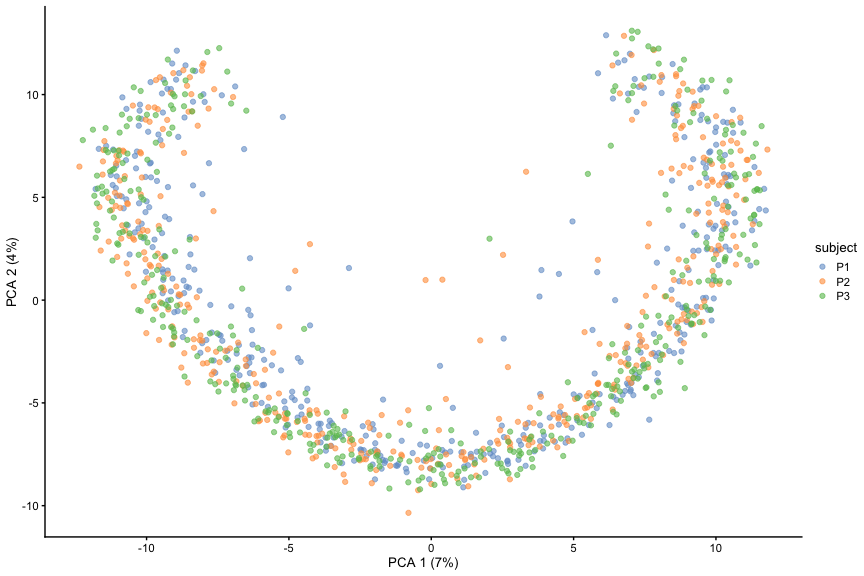
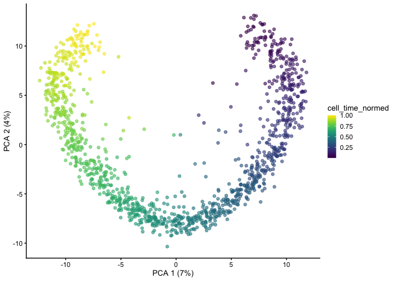

<!-- README.md is generated from README.Rmd. Please edit that file -->

# `scLANE`

<!-- badges: start -->

[](https://codecov.io/gh/jr-leary7/scLANE)
[](https://github.com/jr-leary7/scLANE/actions/workflows/R-CMD-check.yaml)
[](https://opensource.org/licenses/MIT)

<!-- badges: end -->

The `scLANE` package enables users to accurately determine differential
expression of genes over pseudotime or latent time, and to characterize
gene’s dynamics using interpretable model coefficients. `scLANE` builds
upon the [`marge` modeling
framework](https://github.com/JakubStats/marge), allowing users to
characterize their trajectory’s effects on mRNA expression using
negative binomial
[GLMs](https://en.wikipedia.org/wiki/Generalized_linear_model),
[GEEs](https://en.wikipedia.org/wiki/Generalized_estimating_equation),
or
[GLMMs](https://en.wikipedia.org/wiki/Generalized_linear_mixed_model),
depending on the experimental design & biological questions of interest.

A quickstart guide on how to use `scLANE` with simulated data continues
below, and a more detailed vignette showcasing its performance on real
data can be found
[here](https://jr-leary7.github.io/quarto-site/tutorials/scLANE_Trajectory_DE.html).

## Installation

You can install the most recent version of `scLANE` with:

``` r
remotes::install_github("jr-leary7/scLANE")
```

# Usage

Our method relies on a relatively simple test in order to define whether
a given gene is differentially expressed (or “dynamic”) over the
provided trajectory. While the exact structure of the test differs by
model backend, the concept is the same: the spline-based NB GLM / GEE /
GLMM is treated as the alternate model, and a null model is fit using
the corresponding model backend. If the GLM backend is used, then the
null model is simply an intercept-only NB GLM; the GEE backend fits an
intercept-only model with the same working correlation structure as the
alternate model, and if the GLMM backend is used then the null model is
an intercept-only model with random intercepts for each subject. The
alternate hypothesis is thus that at least one of the estimated
coefficients is significantly different from zero. We predict a given
gene to be dynamic if the adjusted *p*-value of the test is less than an
*a priori* threshold; the default threshold is 0.01, and the default
adjustment method is [the Holm
correction](https://en.wikipedia.org/wiki/Holm–Bonferroni_method).

## Input Data

`scLANE` has a few basic inputs with standardized formats, though
different modeling frameworks require different inputs; for example, the
GEE & GLMM backends require a vector of subject IDs corresponding to
each cell. We’ll start by simulating some scRNA-seq counts data with a
subset of genes being dynamic over a trajectory using the [`scaffold` R
package](https://github.com/rhondabacher/scaffold). As part of our
simulation studies I wrote the function sourced below to generate
multi-subject scRNA-seq datasets with trajectories partially conserved
between subjects.

``` r
source("https://raw.githubusercontent.com/jr-leary7/scLANE-Sims/main/R/functions_simulation.R")
```

We’ll also need to load a couple dependencies & resolve a function
conflict.

``` r
library(dplyr)
library(scLANE)
library(ggplot2)
library(scaffold)
library(SingleCellExperiment)
library(scRNAseq)
library(scran)
library(purrr)
library(scater)
library(igraph)
library(caret)

select <- dplyr::select
```

We’ll use the `scRNAseq` R package to pull the human pancreas data from
[Baron *et al* 2017](https://doi.org/10.1016/j.cels.2016.08.011) to
serve as our reference dataset. We then simulate a dataset with 3
subjects, 1200 cells allocated equally between subjects, and 10% of the
genes dynamic over the simulated trajectory. We label a gene dynamic at
the population level if (in this case) it’s dynamic in 2/3 subjects.

``` r
set.seed(312)
panc <- scRNAseq::BaronPancreasData(which = "human")
sim_data <- simulate_multi_subject(ref.dataset = panc, 
                                   perc.dyn.genes = 0.1, 
                                   n.cells = 1200, 
                                   perc.allocation = rep(1/3, 3), 
                                   n.subjects = 3, 
                                   gene.dyn.threshold = 2)
```

The PCA embeddings show us a pretty simple trajectory that’s strongly
correlated with the first principal component, and we can also see that
the trajectory is conserved cleanly across subjects.

``` r
plotPCA(sim_data, colour_by = "subject")
```



``` r
plotPCA(sim_data, colour_by = "cell_time_normed")
```



## Differential Expression Testing

Since we have multi-subject data, we can use any of the three model
backends to run our DE testing. We’ll start with the simplest model, the
GLM, then work our way through the other options in order of increasing
complexity. We first prepare our inputs - a dense matrix with cells as
rows & genes as columns (i.e., transposed from the way it’s stored in
`SingleCellExperiment` & `Seurat` objects), a dataframe containing our
cell ordering, and a set of genes to build models for. In reality, it’s
usually unnecessary to fit a model for every single gene in a dataset,
as trajectories are usually estimated using a subset of the entire set
of genes (usually a few thousand most highly variable genes). For the
purpose of demonstration, we’ll select 50 genes each from the dynamic
and non-dynamic populations. Note: in this case we’re working with a
single pseudotime lineage, though in real datasets several lineages
often exist; in order to fit models for a subset of lineages simply
remove the corresponding columns from the cell ordering dataframe passed
as input to `testDynamic()`.

``` r
set.seed(312)
gene_sample <- c(sample(rownames(sim_data)[rowData(sim_data)$geneStatus_overall == "Dynamic"], size = 50), 
                 sample(rownames(sim_data)[rowData(sim_data)$geneStatus_overall == "NotDynamic"], size = 50))
counts_mat <- as.matrix(t(counts(sim_data)[gene_sample, ]))
order_df <- data.frame(X = sim_data$cell_time_normed)
```

### GLM Backend

Running `testDynamic()` provides us with a nested list containing model
output & DE test results for each gene over each pseudotime / latent
time lineage. In this case, since we have a true cell ordering we only
have one lineage. Parallel processing is turned on by default, and we
use 2 cores here to speed up runtime.

``` r
de_test_glm <- testDynamic(expr.mat = counts_mat, 
                           pt = order_df, 
                           genes = gene_sample, 
                           n.potential.basis.fns = 3, 
                           n.cores = 2, 
                           track.time = TRUE)
#> [1] "testDynamic evaluated 100 genes with 1 lineage apiece in 13.941 secs"
```

After the function finishes running, we use `getResultsDE()` to generate
a sorted table of DE test results, with one row for each gene & lineage.
The GLM backend uses a simple likelihood ratio test to compare the null
& alternate models, with the test statistic assumed to be
[asymptotically
Chi-squared](https://en.wikipedia.org/wiki/Likelihood-ratio_test).

``` r
de_res_glm <- getResultsDE(de_test_glm)
select(de_res_glm, Gene, Lineage, Test_Stat, P_Val, P_Val_Adj, Gene_Dynamic_Overall) %>% 
  slice_head(n = 5) %>% 
  knitr::kable(format = "pipe", 
               digits = 3, 
               col.names = c("Gene", "Lineage", "LRT Stat.", "P-value", "Adj. P-value", "Predicted Dynamic Status"))
```

| Gene   | Lineage | LRT Stat. | P-value | Adj. P-value | Predicted Dynamic Status |
|:-------|:--------|----------:|--------:|-------------:|-------------------------:|
| WAPAL  | A       |   261.890 |       0 |            0 |                        1 |
| JARID2 | A       |   187.261 |       0 |            0 |                        1 |
| CBX6   | A       |   168.482 |       0 |            0 |                        1 |
| ISOC2  | A       |   156.899 |       0 |            0 |                        1 |
| IDH3G  | A       |   133.469 |       0 |            0 |                        1 |

After creating a reference table of the ground truth status for each
gene - `1` denotes a dynamic gene and `0` a non-dynamic one - and adding
that binary indicator the the DE results table, we can generate some
classification metrics using [a confusion
matrix](https://en.wikipedia.org/wiki/Confusion_matrix).

``` r
gene_status_df <- data.frame(gene = gene_sample, 
                             True_Gene_Status = ifelse(rowData(sim_data)[gene_sample, ]$geneStatus_overall == "Dynamic", 1, 0))
de_res_glm <- inner_join(de_res_glm, 
                         gene_status_df, 
                         by = c("Gene" = "gene"))
caret::confusionMatrix(factor(de_res_glm$Gene_Dynamic_Overall, levels = c(0, 1)), 
                       factor(de_res_glm$True_Gene_Status, levels = c(0, 1)), 
                       positive = "1")
#> Confusion Matrix and Statistics
#> 
#>           Reference
#> Prediction  0  1
#>          0 50  8
#>          1  0 42
#>                                           
#>                Accuracy : 0.92            
#>                  95% CI : (0.8484, 0.9648)
#>     No Information Rate : 0.5             
#>     P-Value [Acc > NIR] : < 2e-16         
#>                                           
#>                   Kappa : 0.84            
#>                                           
#>  Mcnemar's Test P-Value : 0.01333         
#>                                           
#>             Sensitivity : 0.8400          
#>             Specificity : 1.0000          
#>          Pos Pred Value : 1.0000          
#>          Neg Pred Value : 0.8621          
#>              Prevalence : 0.5000          
#>          Detection Rate : 0.4200          
#>    Detection Prevalence : 0.4200          
#>       Balanced Accuracy : 0.9200          
#>                                           
#>        'Positive' Class : 1               
#> 
```

### GEE Backend

The function call is essentially the same when using the GLM backend,
with the exception of needing to provide a sorted vector of subject IDs
& a desired correlation structure. We also need to flip the `is.gee`
flag in order to indicate that we’d like to fit estimating equations
models (instead of mixed models). Since fitting GEEs is a fair bit more
complex than fitting GLMs, DE testing with the GEE backend takes a bit
longer. Using more cores and / or running the tests on an HPC cluster
(as this document is being compiled on a 2020 MacBook Pro) speeds things
up considerably.

``` r
de_test_gee <- testDynamic(expr.mat = counts_mat, 
                           pt = order_df, 
                           genes = gene_sample, 
                           n.potential.basis.fns = 3, 
                           is.gee = TRUE, 
                           id.vec = sim_data$subject, 
                           cor.structure = "exchangeable", 
                           n.cores = 2, 
                           track.time = TRUE)
#> [1] "testDynamic evaluated 100 genes with 1 lineage apiece in 4.509 mins"
```

We again generate the table of DE test results. The variance of the
estimated coefficients is determined using [the sandwich
estimator](https://online.stat.psu.edu/stat504/lesson/12/12.3), and a
Wald test is used to compare the null & alternate models.

``` r
de_res_gee <- getResultsDE(de_test_gee)
select(de_res_gee, Gene, Lineage, Test_Stat, P_Val, P_Val_Adj, Gene_Dynamic_Overall) %>% 
  slice_head(n = 5) %>% 
  knitr::kable("pipe", 
               digits = 3, 
               col.names = c("Gene", "Lineage", "Wald Stat.", "P-value", "Adj. P-value", "Predicted Dynamic Status"))
```

| Gene   | Lineage | Wald Stat. | P-value | Adj. P-value | Predicted Dynamic Status |
|:-------|:--------|-----------:|--------:|-------------:|-------------------------:|
| JARID2 | A       |    261.382 |       0 |            0 |                        1 |
| RAB1B  | A       |    620.454 |       0 |            0 |                        1 |
| IDH3G  | A       |    281.062 |       0 |            0 |                        1 |
| MFSD2B | A       |   2330.770 |       0 |            0 |                        1 |
| PFDN2  | A       |    605.955 |       0 |            0 |                        1 |

We create the same confusion matrix for the GEEs as we did before.
Empirically speaking, when the true trend doesn’t differ much between
subjects, the GEEs tend to be more conservative (and thus they perform
slightly worse) than the GLMs. This is shown below, where the GEEs
perform fairly well, but the false negative rate is higher than that of
the GLMs.

``` r
de_res_gee <- inner_join(de_res_gee, 
                         gene_status_df, 
                         by = c("Gene" = "gene"))
caret::confusionMatrix(factor(de_res_gee$Gene_Dynamic_Overall, levels = c(0, 1)), 
                       factor(de_res_gee$True_Gene_Status, levels = c(0, 1)), 
                       positive = "1")
#> Confusion Matrix and Statistics
#> 
#>           Reference
#> Prediction  0  1
#>          0 50 23
#>          1  0 27
#>                                           
#>                Accuracy : 0.77            
#>                  95% CI : (0.6751, 0.8483)
#>     No Information Rate : 0.5             
#>     P-Value [Acc > NIR] : 2.757e-08       
#>                                           
#>                   Kappa : 0.54            
#>                                           
#>  Mcnemar's Test P-Value : 4.490e-06       
#>                                           
#>             Sensitivity : 0.5400          
#>             Specificity : 1.0000          
#>          Pos Pred Value : 1.0000          
#>          Neg Pred Value : 0.6849          
#>              Prevalence : 0.5000          
#>          Detection Rate : 0.2700          
#>    Detection Prevalence : 0.2700          
#>       Balanced Accuracy : 0.7700          
#>                                           
#>        'Positive' Class : 1               
#> 
```

### GLMM Backend

We re-run the DE tests a final time using the GLMM backend. This is the
most complex model architecture we support, and is the trickiest to
interpret. We recommend using it when you’re most interested in how a
trajectory differs between subjects e.g., if the subjects can be
stratified by groups such as Treatment & Control and you expect the
Treatment group to have a different progression through the biological
process. Executing the function with the GLMM backend differs only in
that we switch the `is.glmm` flag to `TRUE` and no longer need to
specify a working correlation structure. **Note**: the GLMM backend is
still under development, as we are working on further reducing runtime
and increasing the odds of the underlying optimization process
converging successfully. As such, updates will be frequent and
functionality / results may shift slightly.

``` r
de_test_glmm <- testDynamic(expr.mat = counts_mat, 
                            pt = order_df, 
                            genes = gene_sample, 
                            n.potential.basis.fns = 3, 
                            is.glmm = TRUE, 
                            id.vec = sim_data$subject, 
                            n.cores = 2, 
                            track.time = TRUE)
#> [1] "testDynamic evaluated 100 genes with 1 lineage apiece in 5.648 mins"
```

Like the GLM backend, the GLMMs use a likelihood ratio test to compare
the null & alternate models. We fit the two nested models using maximum
likelihood instead of REML in order to perform this test; the null model
in this case is a negative binomial GLMM with a random intercept for
each subject.

``` r
de_res_glmm <- getResultsDE(de_test_glmm)
select(de_res_glmm, Gene, Lineage, Test_Stat, P_Val, P_Val_Adj, Gene_Dynamic_Overall) %>% 
  slice_head(n = 5) %>% 
  knitr::kable("pipe", 
               digits = 3, 
               col.names = c("Gene", "Lineage", "LRT Stat.", "P-value", "Adj. P-value", "Predicted Dynamic Status"))
```

| Gene   | Lineage | LRT Stat. | P-value | Adj. P-value | Predicted Dynamic Status |
|:-------|:--------|----------:|--------:|-------------:|-------------------------:|
| LY6G5C | A       |  7143.734 |       0 |            0 |                        1 |
| MPG    | A       |   380.186 |       0 |            0 |                        1 |
| WAPAL  | A       |   360.886 |       0 |            0 |                        1 |
| FLOT2  | A       |   281.259 |       0 |            0 |                        1 |
| SPCS3  | A       |   270.637 |       0 |            0 |                        1 |

The GLMMs perform better than the GEEs, and almost as well as the GLMs.
Like with the GEEs, it’s more appropriate to use these more complex
models when you expect expression dynamics to differ between subjects.
Since the dynamics in our simulated data are strongly conserved across
subjects, it follows that the simpler GLMs perform the best.

``` r
de_res_glmm <- inner_join(de_res_glmm, 
                          gene_status_df, 
                          by = c("Gene" = "gene"))
caret::confusionMatrix(factor(de_res_glmm$Gene_Dynamic_Overall, levels = c(0, 1)), 
                       factor(de_res_glmm$True_Gene_Status, levels = c(0, 1)), 
                       positive = "1")
#> Confusion Matrix and Statistics
#> 
#>           Reference
#> Prediction  0  1
#>          0 49 12
#>          1  1 38
#>                                          
#>                Accuracy : 0.87           
#>                  95% CI : (0.788, 0.9289)
#>     No Information Rate : 0.5            
#>     P-Value [Acc > NIR] : 6.565e-15      
#>                                          
#>                   Kappa : 0.74           
#>                                          
#>  Mcnemar's Test P-Value : 0.005546       
#>                                          
#>             Sensitivity : 0.7600         
#>             Specificity : 0.9800         
#>          Pos Pred Value : 0.9744         
#>          Neg Pred Value : 0.8033         
#>              Prevalence : 0.5000         
#>          Detection Rate : 0.3800         
#>    Detection Prevalence : 0.3900         
#>       Balanced Accuracy : 0.8700         
#>                                          
#>        'Positive' Class : 1              
#> 
```

## Downstream Analysis & Visualization

The main visualization function is `plotModels()`. It takes as input the
results from `testDynamic()`, as well as a few specifications for which
models & lineages should be plotted. While more complex visualizations
can be created from our model output, this function gives us a good
first glance at which models fit the underlying trend the best. Here we
show the output generated using the GLM backend, split by model type &
colored by pseudotime lineage:

``` r
plotModels(de_test_glm, 
           gene = gene_sample[4], 
           pt = order_df, 
           gene.counts = counts_mat)
```


When plotting the models generated using the GLMM backend, we split by
lineage & color the points by subject ID instead of by lineage. The
GLMMs perform well here since the gene’s dynamics differ somewhat
between subjects.

``` r
plotModels(de_test_glmm, 
           gene = gene_sample[2], 
           pt = order_df, 
           is.glmm = TRUE, 
           plot.null = FALSE, 
           id.vec = sim_data$subject, 
           gene.counts = counts_mat)
```


After generating a suitable set of models, we can cluster the genes in a
semi-supervised fashion using `clusterGenes()`. This function uses the
Leiden algorithm (the default), hierarchical clustering, or *k*-means
and selects the best set of clustering hyperparameters using the
silhouette score. If desired PCA can be run prior to clustering, but the
default is to cluster on the fitted values themselves. We then use the
results as input to `plotClusteredGenes()`, which generates a table of
fitted values per-gene, per-lineage over pseudotime along with the
accompanying cluster labels.

``` r
gene_clusters <- clusterGenes(de_test_glm, clust.algo = "leiden")
gene_clust_table <- plotClusteredGenes(de_test_glm, 
                                       gene.clusters = gene_clusters, 
                                       pt = order_df, 
                                       n.cores = 2)
slice_sample(gene_clust_table, n = 5) %>% 
  knitr::kable("pipe", 
               digits = 3, 
               row.names = FALSE, 
               col.names = c("Gene", "Lineage", "Cell", "Fitted (link)", "Fitted (response)", "Pseudotime", "Cluster"))
```

| Gene   | Lineage | Cell | Fitted (link) | Fitted (response) | Pseudotime | Cluster |
|:-------|:--------|:-----|--------------:|------------------:|-----------:|:--------|
| ELOVL2 | A       | 133  |        -3.999 |             0.018 |      0.332 | 3       |
| AMH    | A       | 278  |        -3.401 |             0.033 |      0.695 | 3       |
| TIMP1  | A       | 976  |         3.113 |            22.492 |      0.440 | 2       |
| TMC6   | A       | 1158 |        -2.239 |             0.107 |      0.895 | 3       |
| PFDN2  | A       | 814  |         0.974 |             2.649 |      0.035 | 2       |

The results can then be plotted as desired using `ggplot2` or another
visualization package. Upon visual inspection, the genes seem to cluster
based on whether they are dynamic or static over pseudotime.

``` r
ggplot(gene_clust_table, aes(x = PT, y = FITTED, color = CLUSTER, group = GENE)) + 
  facet_wrap(~paste0("Cluster ", CLUSTER)) + 
  geom_line(alpha = 0.75) + 
  scale_y_continuous(labels = scales::label_number(accuracy = 1)) + 
  scale_x_continuous(labels = scales::label_number(accuracy = 0.1)) + 
  labs(x = "Pseudotime", 
       y = "Fitted Values", 
       color = "Leiden\nCluster", 
       title = "Unsupervised Clustering of Gene Patterns") + 
  theme_classic(base_size = 14) + 
  guides(color = guide_legend(override.aes = list(size = 3, alpha = 1)))
```


Checking the true frequency of dynamic genes in each cluster seems to
confirm that hypothesis:

``` r
distinct(gene_clust_table, GENE, CLUSTER) %>% 
  inner_join(gene_status_df, by = c("GENE" = "gene")) %>% 
  with_groups(CLUSTER, 
              summarise, 
              P_DYNAMIC = mean(True_Gene_Status)) %>% 
  knitr::kable("pipe", 
               digits = 3, 
               col.names = c("Leiden Cluster", "Dynamic Gene Frequency"))
```

| Leiden Cluster | Dynamic Gene Frequency |
|:---------------|-----------------------:|
| 1              |                  0.862 |
| 2              |                  0.926 |
| 3              |                  0.000 |

# Conclusions & Best Practices

In general, starting with the GLM backend is probably your best bet
unless you have a strong prior belief that expression trends will differ
significantly between subjects. If that is the case, you should use the
GEE backend if you’re interested in population-level estimates, but are
worried about wrongly predicting differential expression when
differences in expression are actually caused by inter-subject
variation. If you’re interested in generating subject-specific estimates
then the GLMM backend should be used; take care when interpreting the
fixed vs. random effects though, and consult a biostatistician if
necessary.

If you have a large dataset (10,000+ cells), you should start with the
GLM backend, since estimates don’t differ much between modeling methods
given high enough *n*. In addition, running the tests on an HPC cluster
with 4+ CPUs and 64+ GB of RAM will help your computations to complete
swiftly. Datasets with smaller numbers of cells or fewer genes of
interest may be easily analyzed in an R session on a local machine.

# Contact Information

This package is developed & maintained by Jack Leary. Feel free to reach
out by [opening an issue](https://github.com/jr-leary7/scLANE/issues) or
by email (<j.leary@ufl.edu>) if more detailed assistance is needed.

# References

1.  Bacher, R. *et al*. [Enhancing biological signals and detection
    rates in single-cell RNA-seq experiments with cDNA library
    equalization](https://doi.org/10.1093/nar/gkab1071). *Nucleic Acids
    Research* (2021).

2.  Warton, D. & J. Stoklosa. [A generalized estimating equation
    approach to multivariate adaptive regression
    splines](https://doi.org/10.1080/10618600.2017.1360780). *Journal of
    Computational and Graphical Statistics* (2018).

3.  Nelder, J. & R. Wedderburn. [Generalized linear
    models](https://doi.org/10.2307/2344614). *Journal of the Royal
    Statistical Society* (1972).

4.  Liang, K. & S. Zeger. [Longitudinal data analysis using generalized
    linear models](https://doi.org/10.1093/biomet/73.1.13). *Biometrika*
    (1986).

5.  Laird, N. & J. Ware. [Random-effects models for longitudinal
    data](https://doi.org/10.2307/2529876). *Biometrics* (1988).
